## Description:

I have recently designed a 4 layer PCB for BLDC motor which can operate upto 60V; 100A. This PCB has in-built micro-controller (ESP32), Gate Driver (DRV8323RS) that drives the BLDC Motor, High Voltage MOSFETs, Encoders (AS5047P), CAN BUS IC, 60V to 3.3V (2.5A) Buck Converter (TPS54260), USB to UART (CP2102) communication for programming ESP32 with Type-C, and few internal circuitry.

So, I need to get it reviewed from y'all that whether I am missing out on something or anything that could/ should be changed?
The design layout is provided below.

## 3D Model:

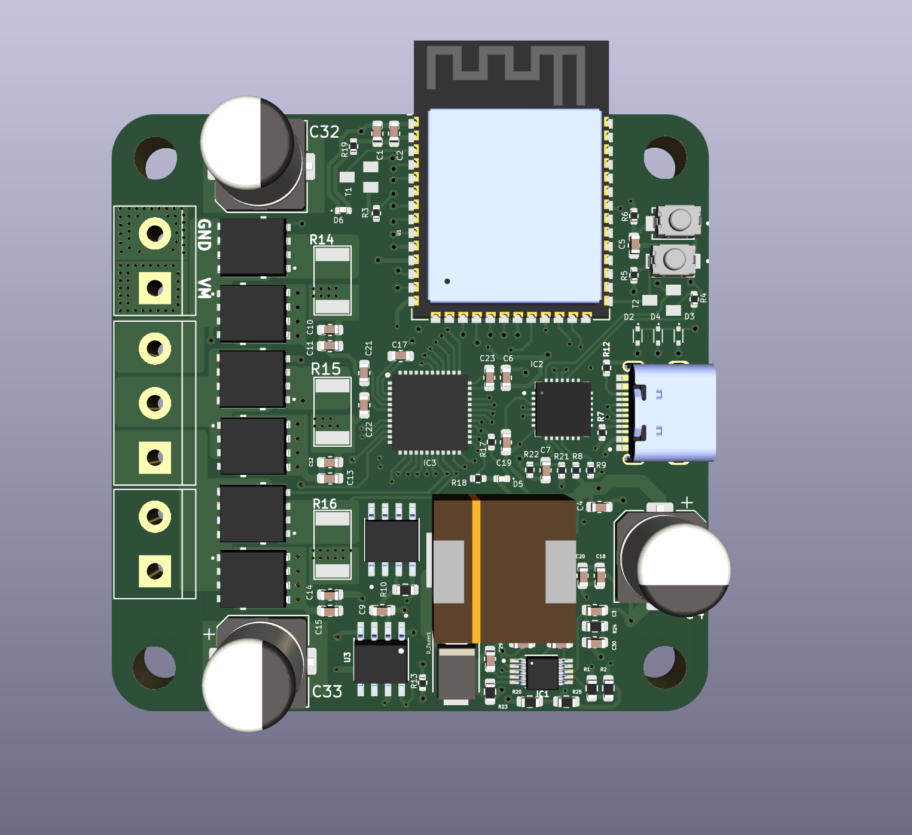

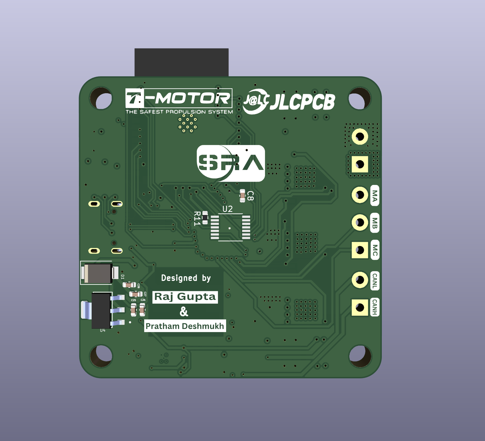

## Schematic Design:

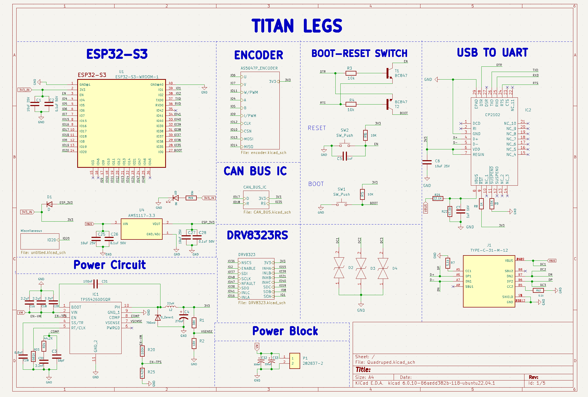

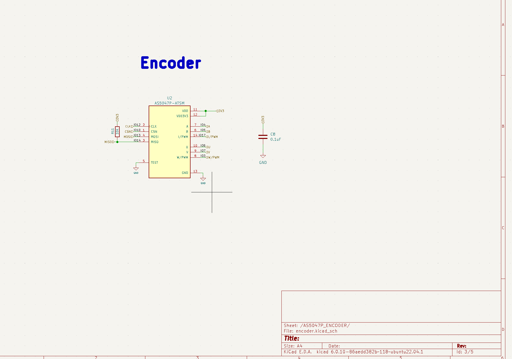

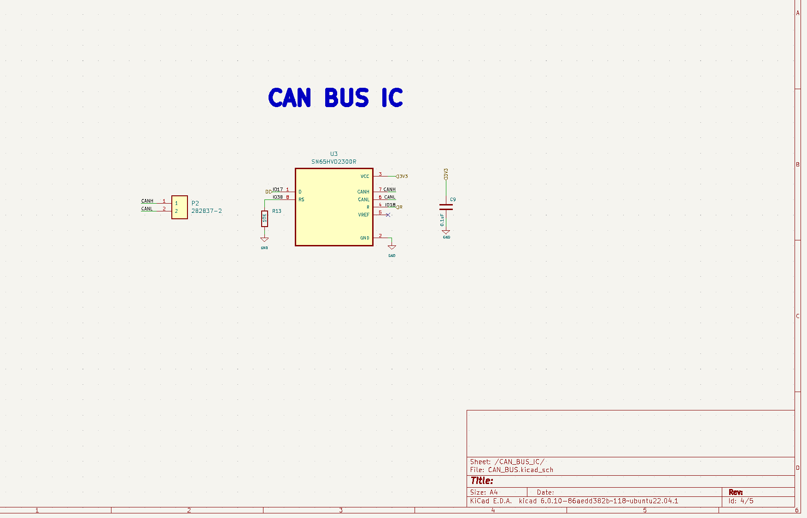

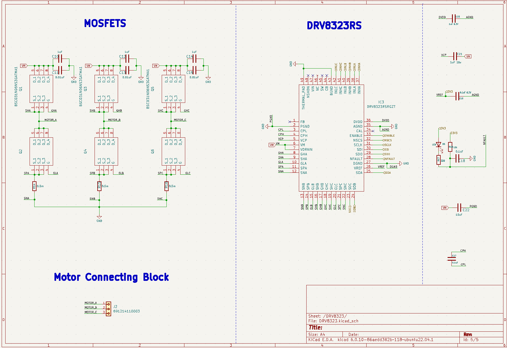

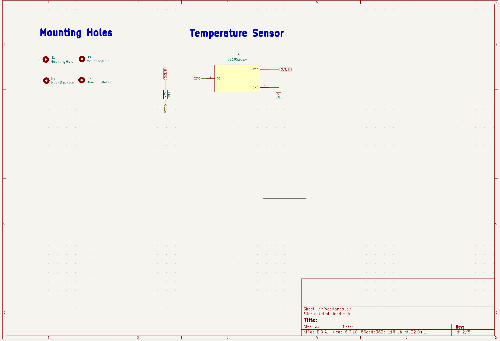

## PCB Layers:

### All Layers

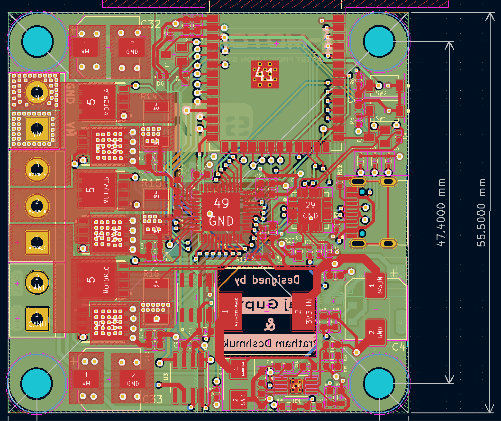

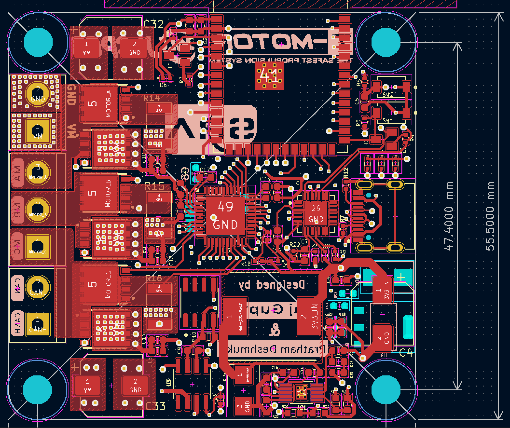

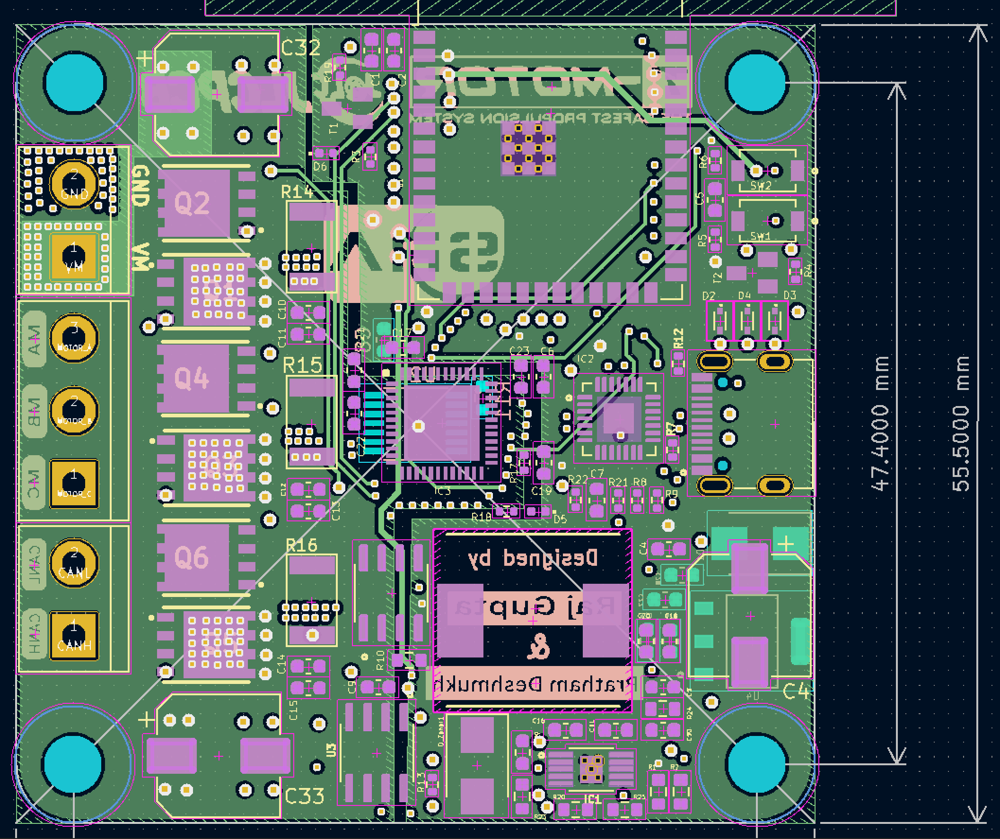

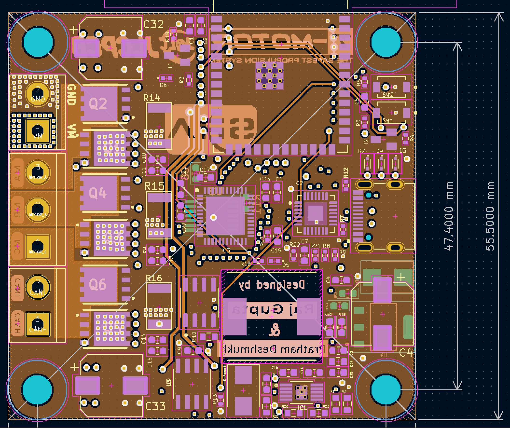

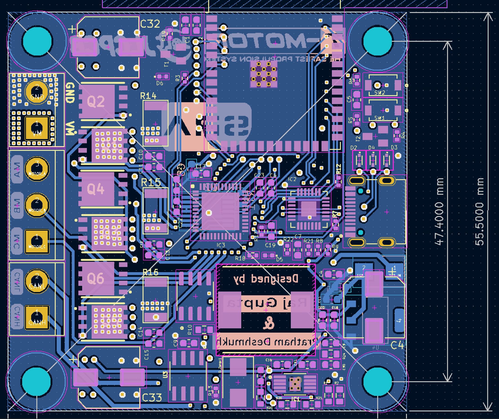
